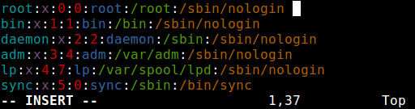
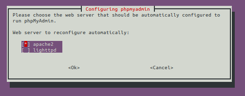

# Linux

```
# File3 is File1 + File2
cat File1 File1 > File3
```

## Disable Root Account

The simplest method to disable root user login is to change its shell from _/bin/bash_ or any other shell that permits user login to _/sbin/nologin_, in the _/etc/passwd_ file, which can be opened for editing using any command line editor, as shown below:

```
sudo nano /etc/passwd
```

Change the line:

`root:x:0:0:root:/root:/bin/bash`  
to  
`root::x::0:0:root:/root:/sbin/nologin`

<figcaption>Figure 1. Change root user shell</figcaption>

Save the file and close it.

From now on, when **root** user logs in, it will be shown the message **"This account is currently not available."** This is the default message, but, you it can be changed to a custom message in the the file */etc/nologin.txt*.

This method is only effective with programs that require a shell for user login, otherwise, sudo, ftp and email clients can access the root account.  
This information was taken from [tecmint][1].

## Permissions

Permissions | Binary | Octal | Description
---|---|--- | ---
\- | 000 | 0 | No permissions
--x | 001 | 1 | Execute-only permission
-w- | 010 | 1 | Write-only permission
-wx | 011 | 1 | Write and execute permissions
r-- | 100 | 1 | Read-only permission
r-x | 101 | 1 | Read and execute permissions
rw- | 110 | 1 | Read and write permissions
rwx | 111 | 1 | Read, write and execute permissions
<figcaption>Table 1. Permissions table</figcaption>

## Nano

- Cursor at the beginning of a file
- Ctrl+6 to set a mark
- Alt+Shift+T (or try Alt+T) to cut to the end of the file
- If Alt+T doesn't work, try Ctrl+K to just copy the file content do Ctrl+U to uncut the text again

## How to connect with PhpMyAdmin to the localhost via a Unix socket?

```
$socket = '/var/run/mysqld.sock'; // or: /tmp/mysqld.sock $db = new mysqli('localhost', 'username', 'password', "database", 3306, $socket); // $db = mysql_connect('localhost:'.$socket, 'username', 'password');
```

OR

in _config.inc.php_, instead of  
`$cfg['Servers'][$i]['host'] = 'localhost';`  
set  
`$cfg['Servers'][$i]['socket'] = '/tmp/mysql.sock';`

## Convert .pem to .crt and .key

```
openssl x509 -outform der -in your-cert.pem -out your-cert.crt
```

## Fedora

### Generic LAMP stack

```
sudo dnf install httpd
sudo dnf install php
sudo dnf install mariadb-server
sudo dnf install phpmyadmin
sudo dnf install mod_ssl
sudo dnf install sshd
```

### Usefull applications

```
sudo dnf install firewalld
sudo dnf install openssh
sudo dnf install procps-ng curl file git
sudo dnf install clamav
sudo dnf install nmap
sudo dnf install nss-tools
sudo dnf install webalizer
sudo dnf install chkrootkit
sudo dnf groupinstall 'Development Tools'
sudo dnf install policycoreutils
sudo chmod 777 /var/www/html
```

### Server permissions

```
# "correct" server folders/files permissions
sudo chown apache:apache -R /var/www/html
sudo usermod -a -G groupname username
sudo find /var/www/html/ -type d -exec chmod 755 {} \;  # 700 for extra security
sudo find /var/www/html/ -type f -exec chmod 644 {} \;  # 600 for extra security *but can't update site*
```

### Server permissions for sftp transfers

```
# server folders/files permissions that allow sftp transfers
sudo chown apache:apache -R /var/www/html
sudo usermod -a -G groupname username
sudo find /var/www/html/ -type d -exec chmod 775 {} \;
sudo find /var/www/html/ -type f -exec chmod 624 {} \;
```

```
# copy files with ssh
# with password
sudo scp username@remoteHost:/remote/dir/file.txt /local/dir/
sudo scp -C -i ~/.ssh/id_rsa user@host:~/file.txt ~/
# with public/private keys
sudo scp -i ~/.ssh/id_rsa FILENAME USER@SERVER:/home/USER/FILENAME
```

```
# scripts
sudo touch /usr/local/bin/script
sudo nano /usr/local/bin/script
sudo chmod +x /usr/local/bin/*
```

```
# list running services
systemctl list-units --type service
```

```
sudo mariadb-dump db > db.sql
mysql -u USERNAME -p DB_NAME < import_file.sql
```

### Apache HTTP server

#### proxy_fcgi:error The timeout specified has expired: [...] AH01075: Error dispatching request to

For [Fedora 35] ensure you have installed fast cgi and optionally php-fph:
```
sudo dnf install mod_fcgid php-fpm
```

Then, if no php-fpm, edit:

```
sudo nano /etc/httpd/conf.d/fcgid.conf
```

Adding the lines:

`FcgidIdleTimeout 1200`  
`FcgidProcessLifeTime 1200`  
`FcgidConnectTimeout 1200`  
`FcgidIOTimeout 1200`

If php-fpm is installed edit/create:

```
vi /etc/httpd/conf.modules.d/00-proxy_timeout.conf
```

And add the lines:

`Timeout 1200`  
`ProxyTimeout 1200`

Then restart php-fpm, if installed, and httpd.

https://stackoverflow.com/a/65935475

### Complete removal of phpMyAdmin

```
sudo dnf remove phpmyadmin
sudo rm -rf /etc/phpMyAdmin
sudo rm -rf /var/lib/phpMyAdmin
```

### Firefox takes a long time to start

Check /etc/hosts

### MariaDB

#### Complete removal of MariaDB

```
sudo dnf remove mariadb mariadb-server
sudo rm -rf /var/lib/mysql
sudo rm -rf /usr/share/mariadb
sudo rm -rf /usr/share/mariadb-server
sudo rm /etc/my.cnf
sudo rm -rf /var/log/mariadb
sudo rm ~/.my.cnf
```

#### Change char_set and collation of server

First run this query

```
SHOW VARIABLES LIKE '%char%';
```

You have character_set_server='latin1'
If so, go into your config file, my.cnf and add or uncomment these lines:

`character-set-server=utf8mb4`  
`collation-server=utf8mb4_unicode_ci`

Restart the server.

#### <span style="color:red;">ERROR 2002 (HY000): Can't connect to local MySQL server through socket '/var/run/mysqld/mysqld.sock' (2)</span>

On a fresh installation, using **mysql_secure_installation** without starting mariadb will make the server run with unix_socket, so the solution is:

```
sudo systemctl start mariadb
sudo mysql_secure_installation
```

And then:

`Switch to unix_socket authentication [Y/n] n`  
`Change the root password? [Y/n] y`  
`New password:`  
`Re-enter new password:`

Another solution would be to delete contents from _/var/lib/mysql_:

```
cd /var/lib/mysql
sudo rm -rf *
sudo systemctl start mariadb
```

#### <span style="color:red;">Access denied for user 'root@localhost' (using password:NO)</span>

```
mysql -u root -p
# if necessary remove root password
SET PASSWORD FOR root@localhost=PASSWORD('');
```

## Ubuntu

```
# generic LAMP stack
sudo dnf install apache2
sudo dnf install php
sudo dnf install mariadb-server
sudo dnf install phpmyadmin
sudo dnf install sshd
```

```
# usefull apps
sudo apt install net-tools
```

```
# http server
sudo service apache2 start
sudo service apache2 stop
sudo service apache2 restart
sudo service apache2 reload
# test config syntax
sudo apachectl -t
```

### phpMyAdmin

#### <span style="color:red;">404 error when opening example.com/phpmyadmin</span>

If this is happening, then maybe apache2 was not ticked during the phpMyAdmin installation screen. To confirm this, check for the presence of _/etc/apache2/conf.d/phpmyadmin_ file.
Reconfigure phpMyAdmin with the following command:

```
sudo dpkg-reconfigure phpmyadmin
```

<figcaption>Figure 2. Configuration screen of phpMyAdmin</figcaption>

Tick _apache2_ using **spacebar**, and **tab** to _\<OK>_.

This information was taken from [askubuntu][2].

# MariaDB

To backup the database use the following command:

```
mysqldump -u root -p database_name > database_name.sql
```

# Windows Subsystem for Linux

Create symlinks for explorer.exe and vscode

```
ln -s /mnt/c/Windows/explorer.exe /usr/local/bin/explorer.exe
ln -s /mnt/c/Users/<User>/AppData/Local/Programs/Microsoft\ VS\ Code/bin/code /usr/local/bin/code
```

## Apache HTTP server

Note: For development, only use \<example>.localhost or \<example>.test for TLD of domain sites in virtual hosts (never use \<example>.dev).

## Using mkcert for secure localhost development on WSL 2

For upcoming features, I need to use HTTPS for local development and I came across mkcert which is a tool to create locally trusted certificates. However, I do most of my development through WSL, and so I thought I'd be out of luck with using mkcert.  
I then came across a useful description in a Github Issues thread for this exact scenario.  
Following alanaasmaa's steps:  
1. Install mkcert on Windows - Chocolatey can be used for this
2. Run mkcert -install
3. Install mkcert on Ubuntu WSL
4. Run mkcert -install on Ubuntu
5. Back in a Windows PowerShell terminal run mkcert -CAROOT to find out where the certificates were created on Windows. Copy these
6. On Ubuntu run mkcert -CAROOT and then explorer.exe to open File Explorer on Windows at the Ubuntu directory.
7. Paste the certificates from step 5
8. Run mkcert -CAROOT again on Ubuntu (Not sure if this step is necessary but it works!)
9. Create certificates on WSL e.g. mkcert example.com "*.example.com" localhost
10. Configure nginx or Apache to use the generated certificates

The reason for installing mkcert on both Windows and Ubuntu is so that the browsers on Windows trust the certificates supplied by the nginx server on Ubuntu.  
The final step I had to do was edit the hosts file on Windows at C:\Windows\System32\drivers\etc\hosts with Notepad in Administrator mode.  
I can now view https://bowie.test locally.

This information was taken from [haveiplayedbowie][3].

### curl: SSL certificate problem: unable to get local issuer certificate

Relating to 'SSL certificate problem: unable to get local issuer certificate' error. It is important to note that this applies to the system sending the CURL request, and NOT the server receiving the request.  
1. Download the latest cacert.pem from https://curl.se/ca/cacert.pem
2. Add the '--cacert /path/to/cacert.pem' option to the curl command to tell curl where the local Certificate Authority file is.
3. (or) Create or add to a '.curlrc' file the line: cacert = /path/to/cacert.pem See 'man curl', the section about the '-K, --config <file>' section for information about where curl looks for this file.
4. (or if using php) Add the following line to php.ini: (if this is shared hosting and you don't have access to php.ini then you could add this to .user.ini in public_html).  
curl.cainfo="/path/to/downloaded/cacert.pem"  
Make sure you enclose the path within double quotation marks!!!
5. (perhaps also for php) By default, the FastCGI process will parse new files every 300 seconds (if required you can change the frequency by adding a couple of files as suggested here https://ss88.uk/blog/fast-cgi-and-user-ini-files-the-new-htaccess/).

This information was taken from [stackoverflow][4].

## Sharing SSH keys between Windows and WSL 2

An SSH key is specific to a machine. Your machine. The problem is that the Linux distro you install in WSL see's itself as its own operating system, and it wants its own set of SSH keys. The primary value proposition of WSL is that you can have both Linux AND Windows. As a developer, this is quite compelling as you can develop for both platforms on both platforms but with only one machine and without having to constantly switch OS
s. This means that you would need a set of SSH keys for Linux and one for Windows, ultimately treating your machine as 2 machines instead of one.

A better solution would be to share the same set of SSH keys between Windows and WSL so that you have one set of keys for one machine.

Setup SSH on Windows first

My recommendation is that you set up SSH on the Windows side first. Follow the instructions over on GitHub's documentation to do this. It will walk you through generating the key, starting the agent and then adding your key to GitHub.
Copy keys to WSL

To use this same set of keys in WSL, you first need to copy them over. The keys are almost always located at c:\Users\<username>\.ssh. That's a folder. You will need to copy that entire folder from Windows, to WSL.

Open a terminal instance attached to WSL. Might I recommend the free Windows Terminal? You'll love it. I promise. If you're not 100% satisfied, you can get your money back - no questions asked.

Execute the following command to copy the keys from Windows to WSL.

cp -r /mnt/c/Users/<username>/.ssh ~/.ssh

    Note that if you installed Github desktop, you do not need to setup SSH keys on the Windows side, and the .ssh folder will not be present. Make sure you follow the Github instructions above to generate the SSH keys on Windows.

Fix permissions

If you were to try and push something to Github from WSL, it will warn you that it doesn't recognize the remote host and it will ask you if you want to connect. Type "yes". Then you will get an error that looks something like this…

terminal showing unprotected private key

Like nearly everything that goes wrong on Linux, this is a permissions issue. You need to adjust the permissions on the key file to get this working. To do that, run the following command from WSL.

`chmod 600 ~/.ssh/id_rsa`

What this does is set Read/Write access for the owner, and no access for anyone else. That means that nobody but you can see this key. The way god intended.

Now try and push to Github…

terminal showing RSA host key message

Success!

Now, you will be asked to enter your passphrase every single time you try and push to Github. That's going to get old in a hurry. This is because the ssh agent isn't running on the Linux side. To get the agent running when WSL starts, first install keychain.

sudo dnf install keychain

Then add the following line to your ~/.bashrc file…

eval `keychain --eval --agents ssh id_rsa`

Each time you reboot, you'll have to enter your passphrase. But you only have to do it one time until you reboot or terminate WSL.

From a [Microsoft dev blog][5].

## Adding Flutter to WSL

### Installing Flutter

Let's install Flutter on our newly operational Ubuntu system. In your terminal, make a Development folder.

```
mkdir Development
```

Then, go to the [Flutter installation page](https://docs.flutter.dev/get-started/install/linux#install-flutter-manually) and download the tar file to get started.

It is important to note that you will only be able to download the file in the Windows Downloads folder, but later on, we can enter our terminal and extract the file in the Development folder we just created in Ubuntu.

This is possible because the Ubuntu side considers Disk C (the disk where all Windows content is) a mounted drive, which means we can access all Windows side files in the /mnt folder. For example, getting to the Downloads folder on Windows through the terminal would look like this: `/mnt/c/Users/your-username/Downloads`.

To extract the Flutter tar file out of the Downloads folder in Windows into the Development folder in Ubuntu, enter your terminal and navigate into the Development folder:

```
cd Development
```

Then run the below command:

```
tar xf /mnt/c/Users/your-username/Downloads/flutter_linux_your-flutter-version-stable.tar.xz
```

Once the folder is extracted, add Flutter into your PATH by editing your shell's rc file. If you use Bash, run sudo nano $HOME/.bashrc, or if you use ZSH, run sudo nano $HOME/.zshrc and enter your password to edit your file.

Navigate to the bottom of the file and add the path where your Flutter folder is found. In this tutorial, Flutter is saved in the Development folder meaning our path will look like the below:

```
export PATH="$PATH:$HOME/Development/flutter/bin"
```

Save and exit your file and then run the below command to refresh your terminal and implement the changes:

```
source $HOME/.<rc file>
```

You can then run which flutter to confirm that the Flutter command now works in your terminal. If there are no errors, you can run the below command to make sure everything is working as it should:

```
flutter doctor
```

This will show a checklist that indicates what is working fine and what still needs installation. The checklist will show that we need Android Studio and Android SDKs installed next.

### Install Android Studio

We will install Android Studio directly to our Ubuntu side. Go to the terminal in the home directory and create a Downloads directory.

```
mkdir Downloads
```

Go to the [Android Studio downloads page](https://developer.android.com/studio/#downloads) and select the Linux platform.


Android Studio downloads page

It will open a popup for you to accept Android's terms and conditions. Scroll to the bottom, accept the terms and conditions, and then right-click the Download button and copy the download link.


The picture shows a popup that opens to accept Android's terms and conditions and start the Android Studio download

In your terminal, go to your newly created Downloads folder and type the wget command followed by the download link you just copied to get the Android Studio tar file:

```
wget android-studio-download-link
```

When the download has finished, navigate to /usr/local/ and extract the Android Studio tar file which will create an android-studio folder for your user profile:

```
cd /usr/local/  
tar xf ~/Downloads/android-studio-version-number-linux.tar.gz
```

Still inside the `/usr/local` directory, run `android-studio/bin/studio.sh` to launch Android Studio.

The first time you run Android Studio, an error about not being able to find SDKs may pop up. That error can be ignored because SDKs will be installed later.

When the installation guide comes up, you may choose to do the default installation or the custom installation that allows you to select file locations for the SDK. Accept all the prompts or select a location for the SDK and other folders and click the Finish button when done.

After Android Studio has installed the SDK and other core files, click the More Actions button on the application that opens up and select SDK Manager.


This picture shows how to get to the SDK Manager once Android Studio is fully installed

A page will open up where you can install the latest SDK Command-Line tools and Google Play services for our virtual devices.


The picture shows SDK Manager

The next stage is to create a virtual device to test our Flutter app.

If you try creating a virtual device right away, you will probably get an error about needing `/dev/kvm` installed before you can proceed. Learn about KVM and how to fix this error [here](https://www.ahmedbouchefra.com/dev-kvm-not-found-device-permission-denied-errors-linux-ubuntu-20-04-19-04/#:~:text=After%20enabling%20KVM%2C%20you%E2%80%99ll%20likely%20have%20another%20error,and%20run%20the%20following%20command%20to%20install%20qemu-kvm%3A).

Once you have installed KVM from the link above, you can proceed to create a virtual device. Cancel the SDK Manager if it is still open and click the More Actions button inside the original Android Studio window. Then click the Virtual Device Manager to start creating a virtual device.


This picture shows how to get to the virtual device manager

Once the Virtual Device Manager opens, click the Create Device button and select a device you would like to use. For this tutorial, we will use a Pixel 2.


Picture shows a list of devices available for usage

Click Next and select an Android version to download and use on the virtual device.


Picture shows a list of Android versions to choose to attach to the emulator

When you have downloaded and selected your preferred Android version, click Next and choose a name for your device. You can leave the default name or name it something else, and you can make as many different virtual devices as you need to.


The picture shows the page where the emulator name can be changed

Click Finish to complete the creation of the virtual device, and click the green play button to launch it.

Run `flutter doctor` again, and this time, every checkbox should be ticked, which means we have everything we need to get started with Flutter.

### Coding Our Flutter App in Visual Studio Code

Next, we need to create a Flutter app and set up a code editor like Visual Studio Code (VS Code) so that we can begin coding our Flutter app.

### Flutter with VS Code

We need to install extensions that can help with Flutter development. Install the [Flutter](https://marketplace.visualstudio.com/items?itemName=Dart-Code.flutter) and [Dart](https://marketplace.visualstudio.com/items?itemName=Dart-Code.dart-code) extensions to get code snippets and Flutter support.

We can also install an emulator extension that allows us to effortlessly run our installed Android emulators without having to open Android Studio every single time, as that can be very slow.

Close Android Studio and the virtual device we opened earlier and install the [Android iOS Emulator](https://marketplace.visualstudio.com/items?itemName=DiemasMichiels.emulate) extension which will make emulator opening quick and easy.

Once the extension is installed, we need to give it the path to our emulator location so that it knows where to find our emulators.

Enter your VS Code settings by pressing `Ctrl + ,` on your keyboard and click Extensions on the left side of the screen. Once the list of extensions opens up, click Emulator Configuration to open the settings for the emulator.


Emulator extension settings

Fill in the Emulator: Emulator Path Linux text field with the path to your emulator inside the SDK folder. If you followed this tutorial, the path would be like below, but put the path that applies to you:

```
~/Android/Sdk/emulator
```

Cancel the Settings page and press Ctrl + Shift + e on your keyboard to run the extension.


Picture shows the running emulator extension

Click View Android Emulators, and it will show a list of installed emulators in your system. Select the one you wish to use and it will open up, ready to be used without opening Android Studio.


Picture shows an emulator list

### Running the Flutter app

After starting VS Code on the Flutter project root folder you can open the app in your emulator, go to the terminal under your project and type `flutter run`.

You can make changes to the app in VS Code, and those changes can be viewed instantly by pressing either `r` or `R` in the terminal.


From [DEV by Maria Situmbeko][7].

## Fix /dev/kvm is Not Found and Device Permission Denied Errors on Linux/Ubuntu 20.04/19.04

When working with Android SDK and Android Studio to develop mobile apps on your Linux Ubuntu 20.04, you often need to use emulators to test your apps. In this case, you will need to use an AVD (Android Virtual Device) to create a new device, but sometimes, you'll encounter problems when creating new virtual devices with the `/dev/kvm is not found` and `/dev/kvm` device permission denied error messages.

### What's KVM and How to Enable It?

KVM stands for Kernel-based Virtual Machine and it's a full virtualization solution for Linux on x86 hardware containing virtualization extensions (Intel VT or AMD-V).

### Solving `/dev/kvm is not found` Error

You need to enable KVM, from the BIOS by pressing F1 key before the system boot. Next, go to the Security tab and enable Intel Virtualization Technology and Intel VT-d Feature. Save the new settings by pressing F10. Finally, exit and restart your computer.

### Solving `/dev/kvm device permission denied` Error

After enabling KVM, you'll likely have another error message that says `/dev/kvm device permission denied`

To fix this error. you need to install `qemu-kvm` and add your username to the kvm group.

Head over to your terminal and run the following command to install qemu-kvm:

```
sudo apt install qemu-kvm
```

Next, you need to add the user your-username to the kvm group using the following command:

```
sudo adduser username kvm
```

Next, in some cases, you also need to run the following command:

```
sudo chown username /dev/kvm
```

You can get your username using the following command:

```
whoami
```

Now, you can verify if your username is added to kvm group using the following command:

```
grep kvm /etc/group
```

If your user name is added. Finish by restarting your Ubuntu 20 system.

Next, follow the steps tp create a new AVD, to start using your Android emulator.

From [Ahmed Bouchefra's blog][8].

# GitHub

## remove github-pages from Environments in GitHub repository


There doesn't seem to be UI for it, but you can do it using the GitHub API.

You should probably disconnect GitHub and Heroku before doing this.

First, go to your GitHub account settings, then developer settings, then personal access tokens. Create a new token that has repo_deployments allowed. After it's generated, save the hexadecimal token, you'll need it for the upcoming API requests.

For these examples I'll assume that your username is $aaaa and your repo name is $bbbb and your access token is $tttt. Replace these with your actual username and repo name and access token. Or just use shell variables to store the actual values which will let you paste the code blocks directly.

First, list all the deployments on your repo:

curl https://api.github.com/repos/$aaaa/$bbbb/deployments

Each deployment has an id integer. Note it, and replace $iiii in the upcoming code blocks with that ID. Or create another shell variable for it.

Now you have to create an "inactive" status for that deployment:

curl https://api.github.com/repos/$aaaa/$bbbb/deployments/$iiii/statuses -X POST -d '{"state":"inactive"}' -H 'accept: application/vnd.github.ant-man-preview+json' -H "authorization: token $tttt"

And now you can delete the deployment forever:

curl https://api.github.com/repos/$aaaa/$bbbb/deployments/$iiii -X DELETE -H "authorization: token $tttt"

If you have multiple deployments, send the first request to see all the deployments that remain, and then you can delete those too if you want.

After you delete all the deployments, the environments button on the GitHub repo will disappear.

Information sourced from the GitHub deployments documentation and the GitHub oauth documentation. This worked for me.

https://stackoverflow.com/a/61272173/6569950

# Latex

## Stop and start `enumerate`

\newcounter{myenumi}
\setcounter{myenumi}{0}

\newenvironment{myenumerate}{
\setcounter{myenumi}{0}
\begin{enumerate}
\setcounter{enumi}{\value{myenumi}}
}{
\setcounter{myenumi}{\value{enumi}}
\end{enumerate}
}

\newenvironment{continuemyenumerate}{
\begin{enumerate}
\setcounter{enumi}{\value{myenumi}}
}{
\setcounter{myenumi}{\value{enumi}}
\end{enumerate}
}

Then I do

\begin{myenumerate}
   \item this is item 1
   \item this is item 2
\end{myenumerate}
Here is some text that I don't want to be in my list.
\begin{continuemyenumerate}
   \item this is item 3
\end{continuemyenumerate}
I could repeat this for more items if I wanted.

\begin{myenumerate}
\item This is back to item 1
\end{myenumerate}

https://tex.stackexchange.com/a/230004

[1]: https://www.tecmint.com/disable-root-login-in-linux/
[2]: https://askubuntu.com/a/306130
[3]: https://www.haveiplayedbowie.today/blog/posts/secure-localhost-with-mkcert/
[4]: https://stackoverflow.com/questions/24611640/curl-60-ssl-certificate-problem-unable-to-get-local-issuer-certificate
[5]: https://devblogs.microsoft.com/commandline/sharing-ssh-keys-between-windows-and-wsl-2/
[6]: https://stackoverflow.com/a/61272173/6569950
[7]: https://dev.to/mariasitumbeko/creating-a-flutter-app-on-windows-with-wsl2-3an0
[8]: https://www.ahmedbouchefra.com/dev-kvm-not-found-device-permission-denied-errors-linux-ubuntu-20-04-19-04/#:~:text=After%20enabling%20KVM%2C%20you%E2%80%99ll%20likely%20have%20another%20error,and%20run%20the%20following%20command%20to%20install%20qemu-kvm%3A
